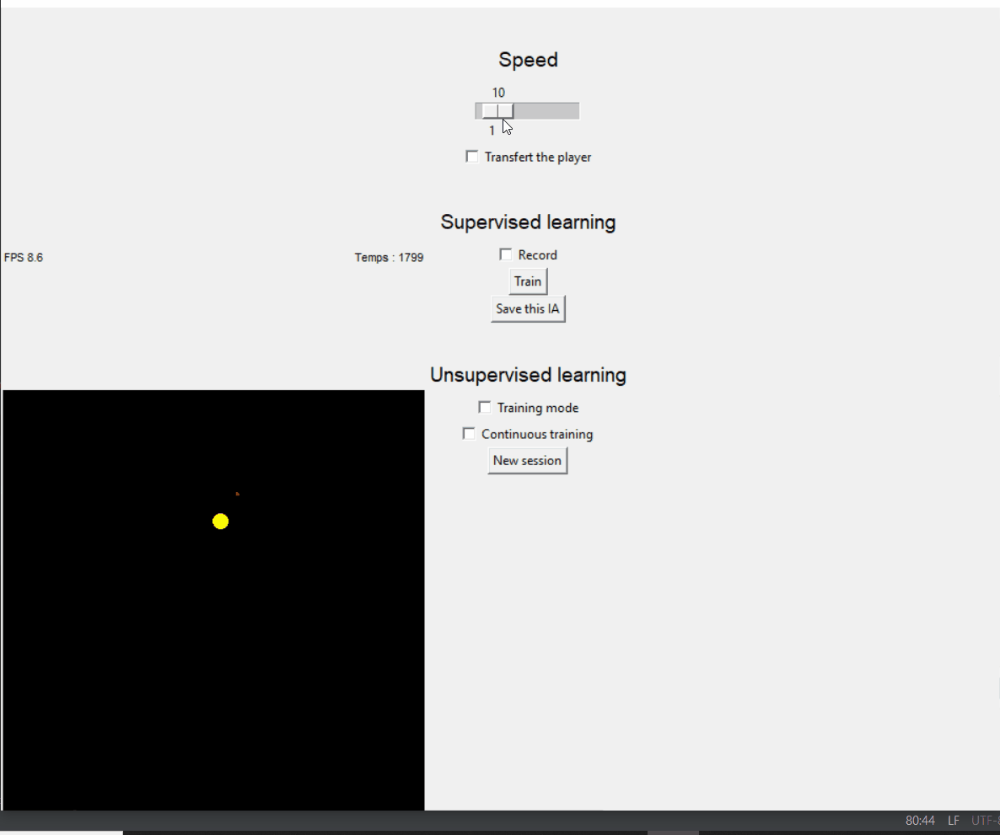
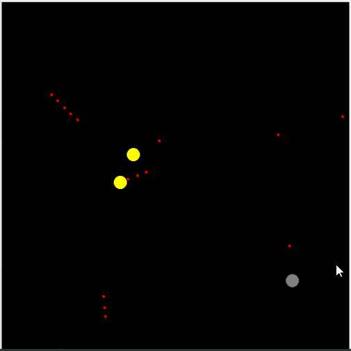
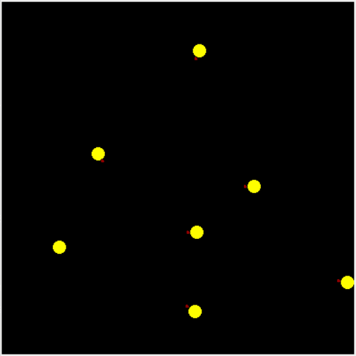

# Ofighters

Space ship combat simulator made for neural network based artificial intelligence.

Screenshots and captures might differ from actual version of the simulator but reflect the overall idea of the interface.


Usage :
```
python ofighters.py
```

## Installation
With conda
```
conda env create -f requirements.yml -n ofighters
conda activate ofighters
```

## Features :


##### Player transfer
A ship can be directly controlled by and human by clicking the ```transfert player``` button. The player ship is grey and shoot green lasers.


##### Continuous training
Restart the game every 200 iterations.
The number of iterations can be changed in ```ofighters.py``` by changing the constant ```MAX_TIME```.

##### Neural network based artificial intelligence

Do not actually converge and become good but still fun to watch.


<!-- ##### Graphics -->


