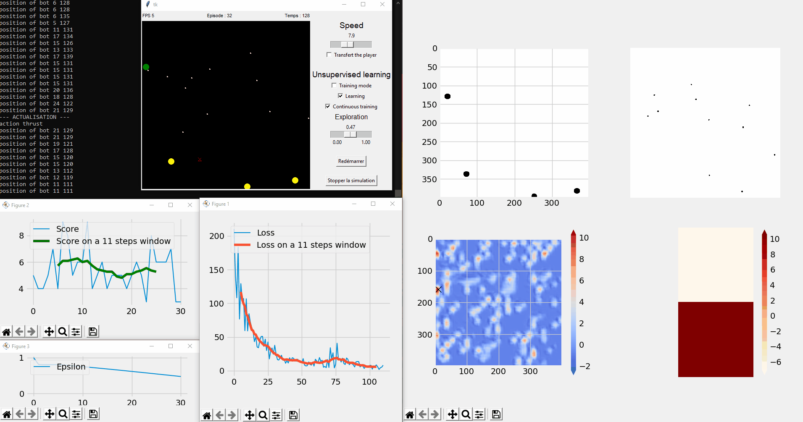
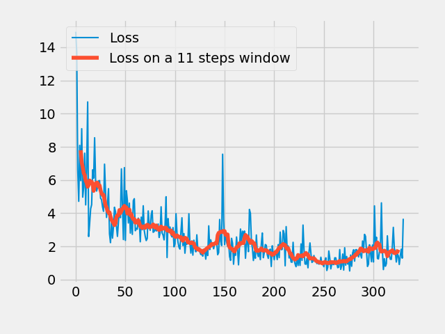
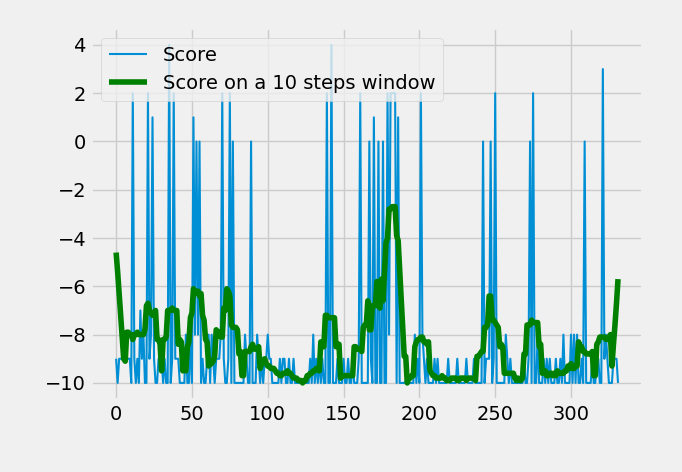
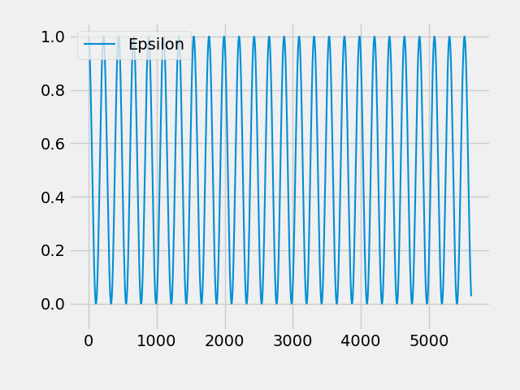
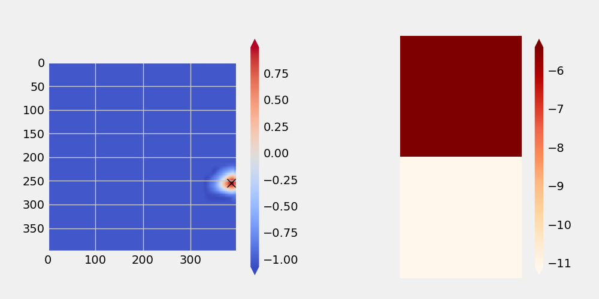
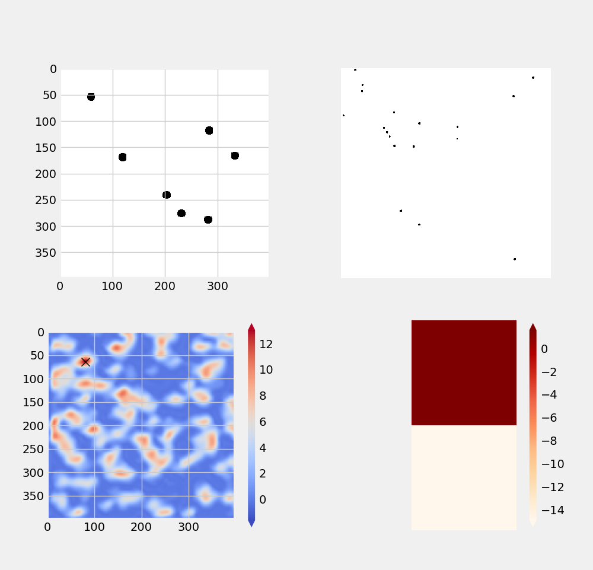

# Ofighters

Spaceship combat simulator made as an artificial intelligence arena.
I'm playing with reinforcement learning, dense and convolutional models with multiple inputs and outputs and neural network made from scratch.

Screenshots and captures might differ from actual version of the simulator but reflect the overall idea of the interface.


Usage :
```
python ofighters.py
```

## Installation
With conda
```
conda env create -f requirements.yml -n ofighters
conda activate ofighters
```

## Features :



##### Player transfer
A ship can be directly controlled by and human by clicking the ```transfert player``` button. The player ship is gray and shoot green lasers.


##### Continuous training
Restart the game every 200 iterations.
The number of iterations can be changed in ```ofighters.py``` by changing the constant ```MAX_TIME```.

##### Neural network based artificial intelligence
Many bots are available, but the main one is based on a combination of convolutional and dense layers with two inputs (2D and 1D) and 2 outputs (2D cursor and 1D action vector). It also uses reinforcement learning to study its past actions and to improve, but it does not actually converge and become good (still fun to watch).


##### Loss graph
Loss graph display the loss of the model used for the bot.
Allows to keep track of progression.



##### Score graph
Score graph display the total score of the bot for each game.
Useful to keep track of the progress on the long run.



##### Exploration rate (epsilon)
There is an exploration rate that define the chances of random actions.
Epsilon graph display this rate against time.
The rate change is automated and can vary linearly or sinusoidally.



##### Action map
The action map displays the decision  weights at the output of the model.
The bot takes decision based on them.



##### Bot inputs
On top of the action map we can see some of the inputs fed to the bot.



