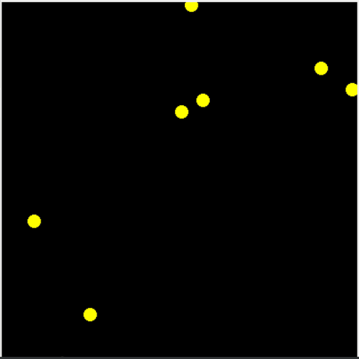

# Ofighters

Space ship combat simulator made for neural network based artificial intelligence.



Usage :
```
python ofighters.py
```

## Features :


##### Player transfer
A ship can be directly controlled by and human by clicking the ```transfert player``` button. The player ship is grey and shoot green lasers.


##### Continuous training
Restart the game and replaces all the ships every 300 iterations.
It aims the future use of renforcement based neural networks.
The number of iterations can be changed in ```ofighters.py``` by changing the constant ```MAX_TIME```.

##### Neural network based artificial intelligence
The neural network based artificial intelligence can be changed by changing the ```MODEL``` constant in ```brAIn.py```.
By default it uses ```part1_09-07-19_sIAmple_pytorch``` which is a partially trained neural network based on 1 dimentional inputs given by the game.
Here is an example of neural network controlled ships :


